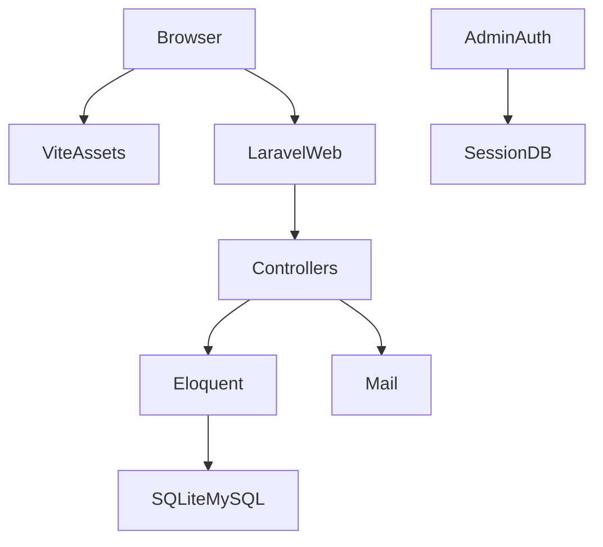

# Porto — Combined engineering review

> **Status:** Fixes applied 2026-09-05 (re-test before ship)  
> **Last updated:** 2026-09-05  
> **Author:** Dozer  
> **Scope:** `porto/` on `main` @ `99e18c0` (local **1 commit ahead** of `origin/main`)  
> **Method:** `/senior-backend` + `/senior-architect` + `/senior-frontend` + `/ai-bug-triage` + `/ai-qa-review` + code-reviewer scripts  
> **Note:** July 2026 `AUDIT.md` is **stale**. Open admin registration, missing 404 view, and SFTP-into-`public_html` are already addressed in current `main`. Do not triage those as live bugs.

## Summary

Porto is a **Laravel 12 modular-monolith CMS** (Blade + Vite + SQLite/MySQL) for a public portfolio and a session-auth admin panel. The latest commit (`Harden portfolio security, CI/CD, and refactor homepage architecture`) is real progress: registration is env-gated (default off), login/contact are throttled, contact mail uses app `From` + visitor `Reply-To`, personal-project HTML is purified on save, deploy targets `/home/dozernap/app` with SSH key + post-deploy artisan, and PHPUnit is **27 tests / 83 assertions, 3× green**.

That is not enough to treat production as closed. **Browser contact `fetch` does not ask for JSON**, so Laravel’s web middleware will **redirect 422/429 as HTML** while tests use `postJson` and stay green. **Checkbox fields (`featured` / `active` / `current`) cannot be turned off** on update. **CI does not generate `APP_KEY`**. **Session cookies are not forced `Secure` in the production checklist.** The public layout is still a **~1700-line CSS dump** plus four CDNs (LCP and CSP both suffer).

**Code-reviewer tooling:** first-commit→HEAD complexity **6 / 10** (Complex), **85 files**, **+13229 / −2709**. Quality checker: PHP `app/` **A (98.0)** over 23 files / **45 smells** (almost all `max:255` magic numbers). JS `resources/js` **A (100)** over 3 files. Architect: **layered** (75%). npm coupling **0/100** (Vite-only; Composer not scored by that script).

**Verdict (review_report_generator scale):** **Request changes** — several high-severity behavioral/ops issues; no current critical unauthenticated-admin hole. Analyzer reported **no hardcoded-secret hits** on this range.

**Verification:** PHPUnit **27 passed**, run **3× green** (1.64s / 1.56s / 1.53s). Coverage **not collected**. Mutation testing **not run**. Browser E2E **not present**. Lighthouse **not run**.

---

## Findings (severity order)

### Critical

None in the current tree. The July audit “open `/admin/register`” item is **fixed** (`ALLOW_ADMIN_REGISTRATION` default `false`; GET/POST register abort 404; `AuthTest` covers it).

### High

| ID | Finding | Where | Why it matters | Fix |
|----|---------|-------|----------------|-----|
| H1 | **Contact JS and tests disagree on content negotiation** | `portfolio-contact.js` `fetch('/contact')` vs `ContactTest` `postJson` | `fetch` default `Accept: */*`. `expectsJson()` is false, so validation/throttle return **302 HTML**, then `.json()` throws and the user only sees a generic catch. Tests never exercise the real browser path. | Send `Accept: application/json` (and keep `X-CSRF-TOKEN`). Add a Feature test that posts JSON **without** the `postJson` helper (or with `Accept: */*`) and asserts 422 JSON. Surface 422 field errors in `#formStatus`. |
| H2 | **Unchecked booleans never persist `false`** | Admin `featured` / `active` / `current` checkboxes; `'featured' => 'boolean'` in validate | Missing checkbox is omitted from `$validated`, so `update()` **leaves the old `true`**. Featured work cannot be un-featured from the UI. | `$request->merge(['featured' => $request->boolean('featured')])` (same for `active`/`current`) before validate, or a hidden `0` input. Test: create featured, PUT without the field, assert `featured === false`. |
| H3 | **CI test job has no `APP_KEY`** | `.github/workflows/ci.yml` (also `deploy.yml` / `staging.yml` test jobs) | Local PHPUnit inherits `.env`. GitHub checkout has **no `.env` and no `APP_KEY` in `phpunit.xml`**. `php artisan test` often fails with “No application encryption key”. | Add a testing key in `phpunit.xml`, or `cp .env.example .env && php artisan key:generate` before tests. Fail CI if that step is skipped. |
| H4 | **`CONTACT_MAIL_TO=` empty in `.env.example` wins over the config default** | `.env.example`; `config/mail.php` `env('CONTACT_MAIL_TO', 'hello@example.com')` | Empty env is not “unset”. Production copy-paste can send to an **empty recipient**. `ProductionSecurityTest` uses phpunit’s non-empty override, so it **does not catch** this. | Require a non-empty address in production (`AppServiceProvider` boot guard) or drop the empty line. Test with `CONTACT_MAIL_TO=` in a dedicated env. |
| H5 | **Session `Secure` flag not in the production checklist** | `config/session.php` `SESSION_SECURE_COOKIE`; `.env.example` checklist | Default `null` lets Laravel infer; mis-set `APP_URL=http://` behind TLS termination can drop the flag. Session cookie on HTTP is session theft on any network. | Set `SESSION_SECURE_COOKIE=true` whenever `APP_ENV=production`. Document next to `SESSION_ENCRYPT=true`. Prefer `same_site=lax` (already default). |
| H6 | **`composer audit` is `continue-on-error: true`** | `ci.yml` | Vulnerable PHP packages will not fail the pipeline. | Remove `continue-on-error` or gate on high/critical only. |

### Medium

| ID | Finding | Where | Notes |
|----|---------|-------|-------|
| M1 | God CSS layout | `layouts/app.blade.php` (~1698 lines), `portfolio-home.css` (~1447) | Homepage `@extends('layouts.app')` still pays for the old neon mega-stylesheet plus Vite CSS. Split tokens; delete unused rules; stop inlining 1.5k lines in `<style>`. |
| M2 | Render-blocking CDNs | `layouts/app.blade.php` Bootstrap, FA, Bootstrap Icons, Devicon, Google Fonts | Four extra origins, no SRI. Hurts **LCP on mobile-4G**. Self-host Inter + subset icons, or drop unused icon sets. |
| M3 | Stored HTML only purified on `PersonalProject` | `PersonalProject::booted` `clean()`; `Project` has none; `{!! $project->content !!}` on personal pages | Client-project pages use `nl2br(e())` (safe). Personal pages trust Purifier. Pre-hook DB rows stay dirty until next save. Re-run `clean()` on read or a one-shot artisan command. |
| M4 | Purifier allows `img[src]` | `config/purifier.php` | Compromised admin (or XSS elsewhere) can embed tracking/remote images. Tighten URI.AllowedSchemes to `https`; consider dropping `img` if unused. |
| M5 | Mail errors swallowed | `ContactController` `catch (\Exception $e)` no `Log::` | Operator cannot see SMTP failures. Log exception; keep generic JSON for the client. |
| M6 | Every `User` is a full admin | `auth` middleware only; no role/permission | Fine for a one-operator site **until** `ALLOW_ADMIN_REGISTRATION=true` or a second user is created in tinker. Add `is_admin` or stop shipping `register()` entirely. |
| M7 | Rate limits are per-IP cache | `throttle:5,1` on login and contact | Cache driver `database` in example; Docker Redis is unused. Multi-proxy without TrustProxies/real IP makes throttle weak or shared. Confirm cPanel `X-Forwarded-For` + `TrustProxies`. |
| M8 | CRUD copy-paste | Seven Admin `*Controller` classes | Same validate/store/update/destroy shape. Form Requests + a thin resource would shrink miss-rate on H2. |
| M9 | `target="_blank"` without `rel="noopener"` | Contact, hero, project CTAs | Tabnabbing is low likelihood; still add `rel="noopener noreferrer"`. |
| M10 | GitHub URL split-brain | contact `dreamcraft17` vs layout `dozernapitupulu` | Wrong social proof / 404. One config value. |
| M11 | Deploy `local_path: './*'` still broad | `deploy.yml` / `staging.yml` | Excludes help, but `storage/`, compiled views, `.phpunit.result.cache` can still sync. Prefer rsync `--exclude-from`. Health check skipped if `APP_URL` secret empty. |
| M12 | Duplicate homepage fossils | `welcome.blade.php` still a large alternate landing | Dead weight; delete or 301. |

### Low

| ID | Finding | Notes |
|----|---------|-------|
| L1 | Conventional Commits | Historical `asd` / `mantap` / `Add auto deploy` ×3. Latest message is fine. |
| L2 | `ExampleTest` `assertTrue(true)` | Zero product signal. Delete. |
| L3 | No `declare(strict_types=1)` | PHP language rule; controllers are simple. |
| L4 | Magic `255` / `2048` in validators | Quality-checker noise; named constants optional. |
| L5 | Indonesian comments in `PortfolioController` | Harmless; keep or translate. |
| L6 | Login has no `autocomplete` / no lockout-by-email | IP throttle only. |

---

## Code-reviewer (scripts + PHP/universal rules)

### PR analyzer (`5fdaf99`…`HEAD`)

- Complexity **6**, label **Complex**.
- **85 files**, +13229 / −2709, **14 commits** in that range.
- Tool **critical/high regex risks: none** (no leftover `eval`, raw `$_GET` SQL, hardcoded keys).
- Review order (tool “critical” category = auth/docs): `SECURITY.md`, PRD, `login.blade.php`, `AuthTest.php`, `ProductionSecurityTest.php`.

### Quality checker (thresholds: fn>50, file>500, nesting>4, complexity>10)

PHP `app/` average **98 / A**. Worst files are still **B (89)** (`ProjectController`, `SkillController`) on magic numbers, not god classes. No file >500 lines in `app/`. Universal hits confirmed by hand: **broad catch without log** (M5); **no unbounded in-app collections**; Eloquent parameterized.

JS: **A / 0 smells** — `portfolio-contact.js` is short and the real defects are **contract** (H1), not cyclomatic complexity.

Blade/CSS god files are **outside** the PHP checker (M1).

---

## Senior architect

Detected pattern: **layered Laravel monolith** (routes → controllers → Eloquent → Blade). Correct for a 1–3 person portfolio CMS. Do **not** extract microservices.



**Hybrid extract triggers (none met):** no independent scaling domain, no second team, no separate data boundary.

**Infra:** documented `public_html` → `app/public` is the right cPanel shape. Ansible playbook is a stub (10 lines) — treat as notes, not IaC.

---

## Senior backend

### What is already solid

- Guest redirect to `admin.login`; authenticated users off the login page to dashboard.
- `Auth::attempt` + `session()->regenerate()`; logout invalidate + regenerate CSRF.
- Contact: validation max lengths, app From, Reply-To visitor, Blade `{{ }}` (escaped) in `emails/contact.blade.php`.
- `throttle:5,1` on login POST and contact POST (covered by tests).
- Unique slugs via `SlugHelper` + DB unique on `projects.slug`.
- Image uploads: `image|mimes:jpeg,png,jpg,gif|max:2048` on public disk (SVG blocked).
- Health endpoint `/up` used in production deploy when `APP_URL` is set.

### Gaps vs backend skill bar

| Assumption | Status |
|------------|--------|
| Read/write ratio + 1y p99 QPS | **TBD** — public read-heavy, admin write-rare. Propose **20:1**, p99 **&lt; 50 QPS**. |
| Tenancy | **Single-tenant** (one operator). |
| Data sensitivity | **PII** (contact name/email/message) + session auth. Not PHI/PCI. |
| SLO + error-budget owner | **TBD** — `/up` only. |

Incomplete without stated **latency, uptime SLO, RPO/RTO**. Suggested floor until product confirms (django-monolith-like brochure + CMS): p50 **≤ 200ms**, p95 **≤ 500ms**, p99 **≤ 800ms** HTML; uptime **99.5%**; RPO **≤ 24h** (DB dump); RTO **≤ 4h** — proposal, not measured.

---

## Senior frontend

| Assumption | Status |
|------------|--------|
| Primary device + network | **Unset** — treat as **mobile-4G** (portfolio). |
| LCP target | **Unset** — profile `astro-or-static` would want **1200ms p75**; current CDN+god-CSS layout will miss that. |
| SEO vs auth-walled | **SEO-dependent public** + **auth-walled `/admin`**. Blade SSR is the right call; do not SPA the marketing pages. |
| WCAG + owner | **Unset**. Partial: contact `aria-live`, some `aria-label`s, image alts. **No skip link.** |

Verifiable bar until confirmed: LCP **≤ 2500ms** p75 mobile-4G, INP **≤ 200ms**, CLS **≤ 0.1**; JS gzip **≤ 80 KB** on `/` (contact module only); Lighthouse a11y **≥ 90**, perf **≥ 70** on home. **Not measured this pass.**

H1 is the main functional frontend bug. M1–M2 dominate performance. Contact labels exist; inputs lack `name` attributes (JS uses `id` only) — fine for fetch, worse for password managers / noscript.

---

## AI bug triage

No CI log dump was supplied. Tickets below are **code-derived** (human approval before filing). Fingerprints are 16-hex-style labels from stable anchors (not LLM similarity). **Do not auto-close** July audit items that are already fixed.

### Ticket A — Contact form JSON contract

- **Fingerprint:** `h1contactaccept001`
- **Category:** application bug · **Severity:** Major · **Priority:** P1
- **Component:** `portfolio-contact` / `ContactController`
- **Title:** Browser contact fetch omits `Accept: application/json`
- **Repro:** Submit invalid contact fields from the homepage (not phpunit `postJson`).
- **Expected:** 422 JSON + field messages in `#formStatus`.
- **Actual:** HTML redirect; frontend `catch` generic error.
- **Related:** throttle 429 same path.

### Ticket B — Featured checkbox stuck on

- **Fingerprint:** `h2checkboxfalse002`
- **Category:** application bug · **Severity:** Major · **Priority:** P1
- **Component:** admin project / personal-project / service / education CRUD
- **Title:** Unchecking `featured`/`active`/`current` does not persist false
- **Evidence:** Laravel `boolean` rule + missing input omitted from `$validated`.

### Ticket C — CI encryption key

- **Fingerprint:** `h3ciappkey000003`
- **Category:** environment issue · **Severity:** Major · **Priority:** P1
- **Component:** `.github/workflows`
- **Title:** `php artisan test` in CI has no `APP_KEY`
- **Note:** Local 3× green does **not** prove GitHub.

### Ticket D — Empty contact recipient

- **Fingerprint:** `h4contactmailto004`
- **Category:** application bug · **Severity:** Major · **Priority:** P2 (P1 if production `.env` copied from example)
- **Component:** `config/mail.php` / `.env.example`

### Ticket E — Stale audit noise

- **Fingerprint:** `auditjulyreg005`
- **Category:** test/docs · **Severity:** Trivial · **Priority:** P3
- **Title:** `AUDIT.md` still lists open registration
- **Action:** Mark superseded by this bundle; do **not** file a P0 from the July text.

Duplicates: none in tracker. Human review required before create/merge.

---

## AI QA review

`.agents/qa-project-context.md` is **absent**. Framework: **PHPUnit 11** Feature/Unit. No Playwright/Vitest.

### Findings by file

| File | Severity | Smells | Notes |
|------|----------|--------|-------|
| `ContactTest.php` | **High** | Closed loop / coverage | Uses `postJson` only. Does not prove H1. Generic `John Doe` / `john@example.com`. Throttle test is good. |
| `XSSTest.php` | Medium | Coverage | PersonalProject only. No Project `{!!` path (that path is escaped — still worth a regression). No `` Purifier case. |
| `AdminPersonalProjectCrudTest.php` | Medium | Happy path | Asserts `<strong>` kept; never unsets `featured`. |
| `AdminProjectCrudTest.php` | Medium | Happy path | Guest redirect + slug + delete. No featured-off, no XSS. |
| `AdminServiceCrudTest.php` | Medium | Multiple behaviors | One test does create/update/delete. Split. No `active` false. |
| `ProductionSecurityTest.php` | **High** | Weak assertion | `assertNotEmpty(config('mail.contact.to'))` true under phpunit env; misses empty `.env` string. |
| `AuthTest.php` / `LoginThrottleTest.php` | Low | — | Solid registration-closed + 429. Keep as regression anchors. |
| `ErrorHandlingTest.php` | Low | — | 404 view present (July gap closed). |
| `ExampleTest.php` (Unit) | High | Weak assertion | `assertTrue(true)`. Delete. |
| `portfolio-contact.js` | **High** | Diagnostic | `.catch()` erases 422/429 distinction; no `response.ok` check before `json()`. |

### Smell buckets

| Bucket | Result |
|--------|--------|
| Readability | Admin tests are short; contact payload helper is fine. |
| Reliability | 3× green, no sleeps. Throttle tests are order-sensitive inside one process (OK). Cache `array` in phpunit vs `database` in prod. |
| Diagnostic | Contact frontend + `postJson` hide the real 422. Mail catch returns generic 500 (OK for users, bad for ops — M5). |
| Design | Seven CRUD controllers untested except projects/personal/services. Education/skills/certs/experience have **no** Feature tests. |
| AI-generated | Generic John Doe; ExampleTest tautology; Indonesian “Tambah ini” comments. |
| Coverage | **Happy path heavy.** Missing: H1 browser Accept, H2 checkbox false, CSRF 419 on contact, oversized upload, `ALLOW_ADMIN_REGISTRATION=true` still hashes password, production `APP_DEBUG` guard. |

### Testability

- **Good:** `SlugHelper` is a pure-ish static (unit tested).
- **Hard:** Blade `{!! !!}` XSS needs HTTP Feature tests (already started). Contact mail needs `Mail::fake` (done) **plus** a non-`postJson` request.
- **DI:** Controllers instantiate nothing heavy; Eloquent in controllers is acceptable at this size. Extract Form Requests when fixing H2.

### PR checklist (current tests)

- [x] Names mostly readable  
- [ ] Setup matches production (contact Accept, empty `CONTACT_MAIL_TO`)  
- [x] No sleep waits  
- [ ] Error + boundary for checkboxes and JSON 422  
- [ ] Assertions specific to real browser JSON  

### Automated gate (this review)

**Warranted:** fail CI if `APP_KEY` missing; add a PHPUnit test that `post('/contact', …, ['Accept' => '*/*'])` with `Content-Type: application/json` still returns JSON 422 (or change the app so it does); delete `tests/Unit/ExampleTest.php`. Mutation score: **not recorded**.

---

## Recommended sequence

1. P1: contact `Accept` + tests (H1 / Ticket A); checkbox `boolean()` merge (H2 / Ticket B); CI `APP_KEY` (H3).  
2. P1/P2: production env guards for `CONTACT_MAIL_TO`, `SESSION_SECURE_COOKIE`, fail `composer audit` (H4–H6).  
3. Trim `layouts/app.blade.php` / CDNs; one GitHub URL; `rel="noopener"`.  
4. Refresh or archive `AUDIT.md` so it cannot reopen fixed P0s.  
5. Push the unpushed `99e18c0` only after H1–H3, or accept that origin is one harden-commit behind locally.

---

## Appendix — evidence commands

```bash
# PHPUnit (3× green in this review)
cd porto && php artisan test --compact

# Quality / PR complexity
python3 ../.cursor/skills/code-reviewer/scripts/code_quality_checker.py app --language php --json
python3 ../.cursor/skills/code-reviewer/scripts/code_quality_checker.py resources/js --language javascript --json
python3 ../.cursor/skills/code-reviewer/scripts/pr_analyzer.py . --base 5fdaf99 --head HEAD --json

# Architect
python3 ../.cursor/skills/senior-architect/scripts/project_architect.py . --verbose
```

Lighthouse / Playwright: **not in repo; not run**.
